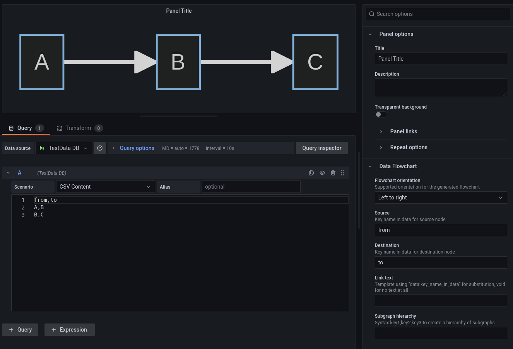

# Grafana Plugin Data Flowchart

This plugin displays a flowchart graph using [MermaidJS](https://github.com/mermaid-js/mermaid)
from queried data.

## Use cases

### Simple flowchart

### Node shape and ID

Identifiers and shapes in data are directly used.

### Link templates

Templates `data:(\w+)` are subtituted from row data.

### Subgraphs

Linked nodes are put in the same subgraph.

### Subgraphs templates

Same subtitution as in link templates: it's possible to declare all or part of
subgraph in row data.

### Different subgraphs for linked nodes

It's possible to declare single nodes in row data, with then different subgraphs.
